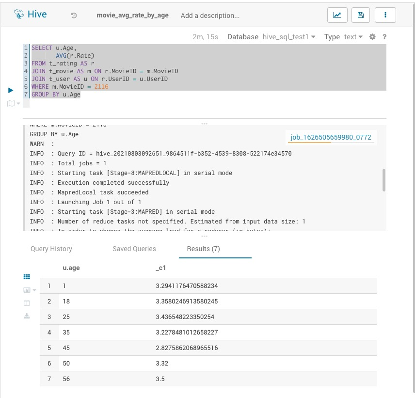
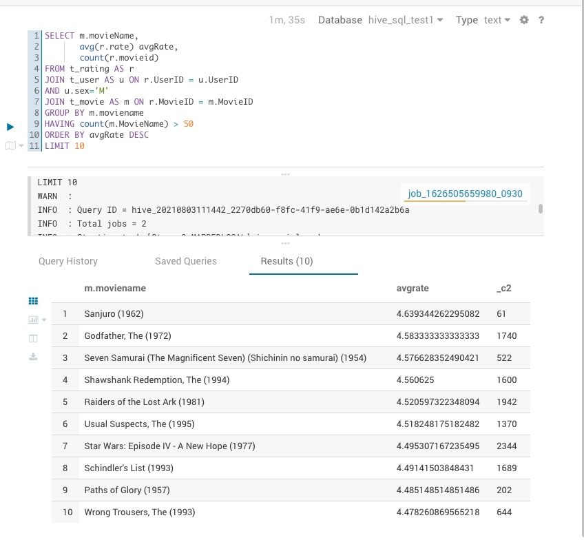
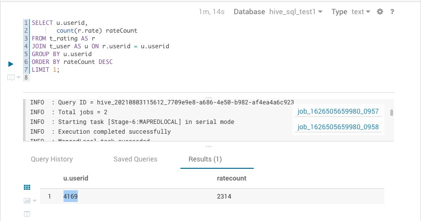
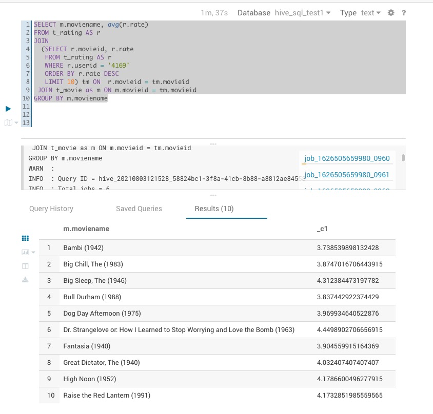

# HSQL practise

## Quiz

1. 简单：展示电影ID为2116这部电影各年龄段的平均影评分
```sql
SELECT u.Age,
       AVG(r.Rate)
FROM t_rating AS r
         JOIN t_movie AS m ON r.MovieID = m.MovieID
         JOIN t_user AS u ON r.UserID = u.UserID
WHERE m.MovieID = 2116
GROUP BY u.Age
```

screenshot of result:  


2. 中等：找出男性评分最高且评分次数超过50次的10部电影，展示电影名，平均影评分和评分次数
```sql
SELECT m.movieName,
       avg(r.rate) avgRate,
       count(r.movieid)
FROM t_rating AS r
         JOIN t_user AS u ON r.UserID = u.UserID
    AND u.sex='M'
         JOIN t_movie AS m ON r.MovieID = m.MovieID
GROUP BY m.moviename
HAVING count(m.MovieName) > 50
ORDER BY avgRate DESC
    LIMIT 10
```

screenshot of result:  

3. 困难：找出影评次数最多的女士所给出最高分的10部电影的平均影评分，展示电影名和平均影评分（可使用多行SQL）
```sql
SELECT u.id,
       count(r.rate) rateCount
FROM t_rating AS r
JOIN t_user AS u ON r.userid = u.userid
GROUP BY r.userid
ORDER BY rateCount DESC
LIMIT 1;
```
screenshot of result:  


```sql
SELECT m.moviename, avg(r.rate)
FROM t_rating AS r
JOIN 
  (SELECT r.movieid, r.rate
   FROM t_rating AS r
   WHERE r.userid = '4169'
   ORDER BY r.rate DESC
   LIMIT 10) m ON  r.movieid = m.movieid
GROUP BY m.moviename
```
screenshot of result:  
