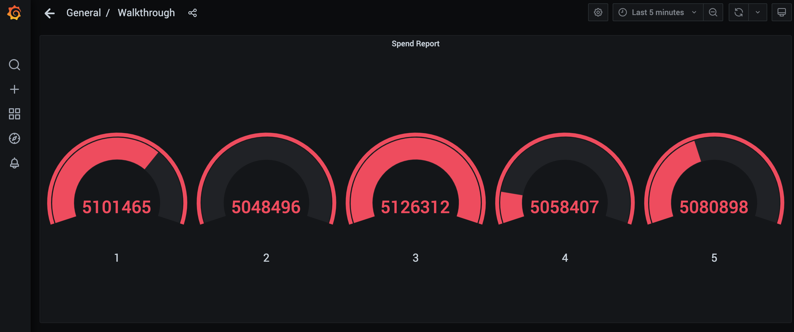

# Flink homework

## 作业题

report(transactions).executeInsert("spend_report");  
将transactions表经过report函数处理后写入到spend_report表。  
每分钟(小时)计算在五分钟(小时)内每个账号的平均交易金额(滑动窗口)?
注:使用分钟还是小时作为单位均可  

## 解答

`SpendReport.java`

```Java
  public static Table report(Table transactions) {
    return transactions
        .window(
            Slide.over(lit(5).minute()).every(lit(1).minute())
                .on($("transaction_time")).as("log_ts"))
        .groupBy($("account_id"), $("log_ts"))
        .select(
            $("account_id"),
            $("log_ts").start().as("log_ts"),
            $("amount").avg().as("amount"));
  }
```

## 运行结果日志

```sql
mysql> select count(*) from spend_report;
+----------+
| count(*) |
+----------+
|    10666 |
+----------+
1 row in set (0.00 sec)

```

Gafana screenshot:  


